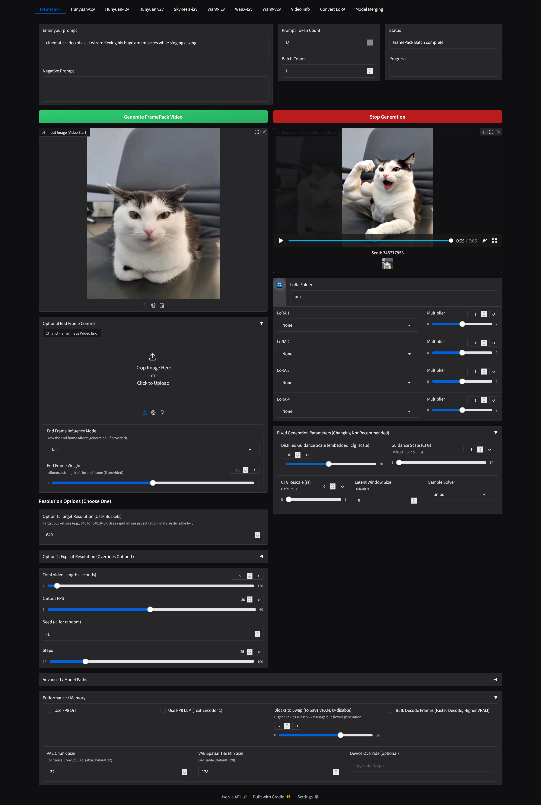

# H1111


This is a GUI for tech wizard kohya-ss's musubi tuner's inference script.
https://github.com/kohya-ss/musubi-tuner

It allows inference with these models:  
Hunyuan-t2v  
Hunyuan-v2v  
WanX-t2v  
WanX-i2v  
WanX-v2v  
SkyReels-i2v  
SkyReels-t2v  

If you are running out of vram use block swapping and some form of attention besides sdpa or torch and use split attention. Sage attention is the fastest/lowest vram but difficult to install in windows. I would say the easiest to get to run is xformers attention, you can usually get it with "pip install xformers".

Best quality will be obtained with only enabling block swapping and using the fp16 model with sdpa attention. You can speed things up with cfg skip, fp8 scaled, slg skip is small speedup, sage attention is fastest but all speedups come with quality degradations. You can use the video to video like you would img2img in Automatic1111 to increase quality possibly.  

If you are using a lora that you didn't train with musubi you need to drag it to the convert lora tab and convert it to the default format. It should spit it out into the /lora folder.

This about the speed I get generating a 960x544 97 frame 40 step video without fp8 using sage attention and skyreels on a 4090: 80%|████████  | 24/30 [11:01<02:45, 27.54s/it]

## To Use Skyreels

To use the Skyreels models, first download Kijai's awesome models:

https://huggingface.co/Kijai/SkyReels-V1-Hunyuan_comfy/resolve/main/skyreels_hunyuan_i2v_bf16.safetensors?download=true  
And  
https://huggingface.co/Kijai/SkyReels-V1-Hunyuan_comfy/resolve/main/skyreels_hunyuan_t2v_bf16.safetensors?download=true  

Place the models inside the hunyuan folder inside of H1111 and select them at the bottom of the page by clicking DIT model

Use the i2v model for image to video.  
Use the t2v model for video to video and text to video.

Most of the lora's for hunyuan will work with skyreels also.

## To Use WanX

To use wanX download these and toss them in the wan subfolder:
Download the T5 `models_t5_umt5-xxl-enc-bf16.pth`, vae `Wan2.1_VAE.pth` and CLIP `models_clip_open-clip-xlm-roberta-large-vit-huge-14.pth` from the following page: https://huggingface.co/Wan-AI/Wan2.1-I2V-14B-720P/tree/main    

Download the DiT weights from the following page: https://huggingface.co/Comfy-Org/Wan_2.1_ComfyUI_repackaged/tree/main/split_files/diffusion_models  
ie : wan2.1_i2v_720p_14B_fp16.safetensors  

git pull to update the installation
pip install -r requirements.txt

I have tested the 14B i2v and t2v models so far to be working

## changlog
3/23/2025  
    Added Wanx cfg skip functionality to skip cfg guidance during inference for faster generations but less following of the prompt  
3/22/2025  
    Added WanX-i2v end frame functionality  
3/20/2025  
    Added WanX-v2v functionality.  
3/18/2025  
    Added Skip Layer Guidance for WanX-i2v.  
3/13/2025  
    Added extend video functionality to WanX-i2v. It kind of works .  
3/12/2025  
    Added ability to send the last frame of a video to the input in WanX-i2v. Also you can now use this to extend the video. You can do multiple batches at each step and pick the best extended video then generate an even longer one.  
3/9/2025  
    Added batching ability for a folder full of images in WanX-i2v tab. Added flash attn for windows prebuilt wheel.  
3/8/2025  
    Added support for wan lora's. Remember to convert them first in the convert lora tab.  
3/5/2025  
    Added ability to batch a folder of images with skyreels i2v, so you can make a video with every image in a folder.
3/2/2025  
    Added initial support for wanX-2.1 Image to Video and Text to Video inference.  
3/1/2025  
    Added support for Skyreels Video to Video and Text to Video.   
2/23/2025  
    Added initial support for skyreels using musubi's skyreel implementation. (thanks  sdbds && Kijai :D)
download models from https://huggingface.co/Kijai/SkyReels-V1-Hunyuan_comfy and add them to your hunyuan folder
skyreels_hunyuan_i2v_bf16.safetensors
skyreels_hunyuan_t2v_bf16.safetensors

## Requirements

- Python 3.10
- CUDA 12.4

## Basic Installation (Linux)

Tested on ubuntu 24

to update navigate to H1111 and git pull

```powershell
git clone https://github.com/maybleMyers/H1111
cd H1111

#to download models
wget https://huggingface.co/tencent/HunyuanVideo/resolve/main/hunyuan-video-t2v-720p/transformers/mp_rank_00_model_states.pt -P hunyuan
wget https://huggingface.co/tencent/HunyuanVideo/resolve/main/hunyuan-video-t2v-720p/vae/pytorch_model.pt -P hunyuan
wget https://huggingface.co/Comfy-Org/HunyuanVideo_repackaged/resolve/main/split_files/text_encoders/llava_llama3_fp16.safetensors -P hunyuan
wget https://huggingface.co/Comfy-Org/HunyuanVideo_repackaged/resolve/main/split_files/text_encoders/clip_l.safetensors -P hunyuan
#fp8 model
wget https://huggingface.co/kohya-ss/HunyuanVideo-fp8_e4m3fn-unofficial/resolve/main/mp_rank_00_model_states_fp8.safetensors -P hunyuan


python -m venv env
#(if you have another version of python do python3.10 -m venv env after you install it with sudo apt install python3.10 python3.10-venv python3.10-distutils)
source env/bin/activate 
pip install torch==2.5.1 torchvision --index-url https://download.pytorch.org/whl/cu124 
pip install -r requirements.txt
pip install ascii-magic matplotlib tensorboard wheel gradio==5.14.0 tiktoken ffmpeg ffmpeg-python
pip install flash-attn --no-build-isolation
pip install sageattention==1.0.6
might need python3.10-dev as well for sage attention to work

```

## Basic Installation (Windows)

#download models

https://huggingface.co/tencent/HunyuanVideo/resolve/main/hunyuan-video-t2v-720p/transformers/mp_rank_00_model_states.pt

https://huggingface.co/tencent/HunyuanVideo/resolve/main/hunyuan-video-t2v-720p/vae/pytorch_model.pt

https://huggingface.co/Comfy-Org/HunyuanVideo_repackaged/resolve/main/split_files/text_encoders/llava_llama3_fp16.safetensors

https://huggingface.co/Comfy-Org/HunyuanVideo_repackaged/resolve/main/split_files/text_encoders/clip_l.safetensors

#fp8 dit model

https://huggingface.co/kohya-ss/HunyuanVideo-fp8_e4m3fn-unofficial/resolve/main/mp_rank_00_model_states_fp8.safetensors

place models in H1111/hunyuan folder

First, open PowerShell and navigate to your desired installation directory. Then run these commands:

```powershell
git clone https://github.com/maybleMyers/H1111
cd H1111
python -m venv env
./env/scripts/activate
pip install torch==2.5.1 torchvision --index-url https://download.pytorch.org/whl/cu124 
pip install -r requirements.txt
pip install ascii-magic matplotlib tensorboard wheel gradio==5.14.0 tiktoken ffmpeg ffmpeg-python

```

## To run

```
python h1111.py
```

open 127.0.0.1:7860 in a browser

### Optional: Install Xformers
```powershell
pip install --no-deps xformers --index-url https://download.pytorch.org/whl/cu124
```

### Optional: Install Flash Attention
Note: This can take 1-5 hour to install even on a good CPU, but provides faster generation.  
I have uploaded a wheel for windows users to match cuda 12.4 and python 3.10.(thanks lldacing)
https://huggingface.co/maybleMyers/wan_files_for_h1111/resolve/main/flash_attn-2.7.4%2Bcu124torch2.5.1cxx11abiFALSE-cp310-cp310-win_amd64.whl?download=true  

```powershell
pip install flash-attn --no-build-isolation

If you have downloaded the wheel you can install it with:

pip install "flash_attn-2.7.4+cu124torch2.5.1cxx11abiFALSE-cp310-cp310-win_amd64.whl"
```
```