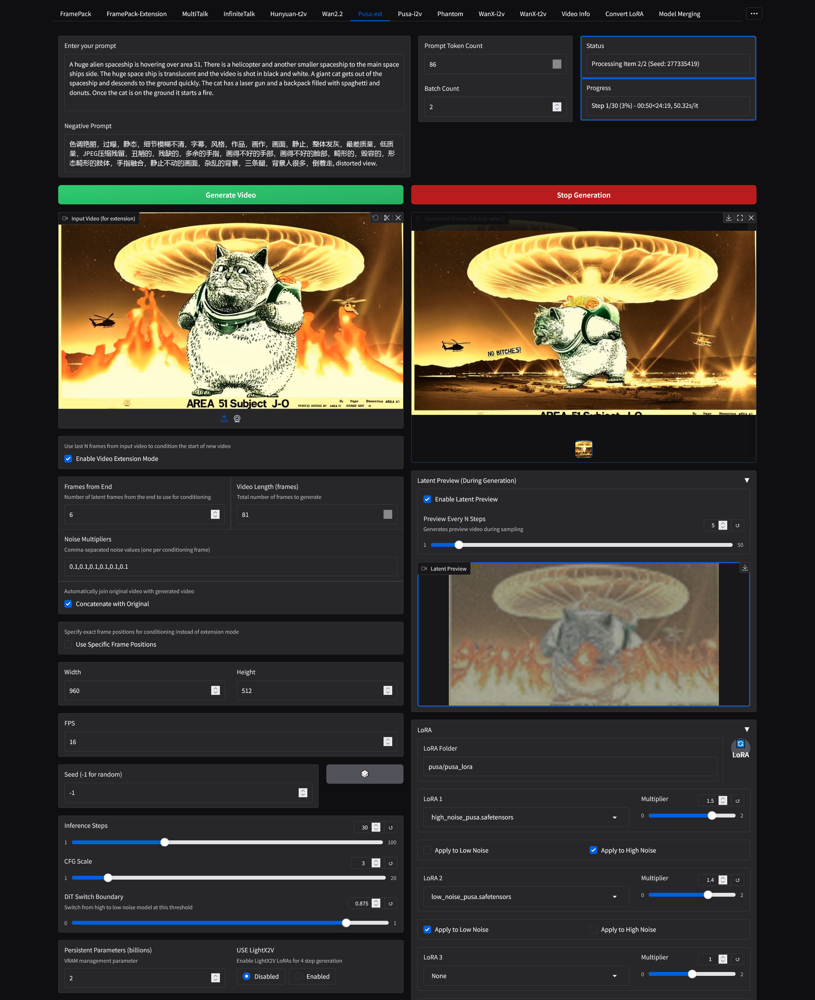

# H1111

This is a GUI for tech wizard kohya-ss's musubi tuner's inference script.
https://github.com/kohya-ss/musubi-tuner

It allows simple inference with hunyuan video model , with video2video, image2video and text2video support.

If you are running out of vram use block swapping and some form of attention besides sdpa or torch and use split attention. Sage attention is the fastest/lowest vram but difficult to install in windows. I would say the easiest to get to run is xformers attention, you can usually get it with "pip install xformers".


## Requirements

- Python 3.10
- CUDA 12.4

## Basic Installation

If you already have musubi tuner installed and running you should just be able to just download h1111.py and hv_generate_video.py and put them in your musubi directory

pip install gradio==5.14.0 tiktoken ffmpeg ffmpeg-python

then run with python h1111.py

## Basic Installation (Linux)

Tested on ubuntu 24

to update navigate to H1111 and git pull

```powershell
git clone https://github.com/maybleMyers/H1111
cd H1111

#to download models
wget https://huggingface.co/tencent/HunyuanVideo/resolve/main/hunyuan-video-t2v-720p/transformers/mp_rank_00_model_states.pt -P hunyuan
wget https://huggingface.co/tencent/HunyuanVideo/resolve/main/hunyuan-video-t2v-720p/vae/pytorch_model.pt -P hunyuan
wget https://huggingface.co/Comfy-Org/HunyuanVideo_repackaged/resolve/main/split_files/text_encoders/llava_llama3_fp16.safetensors -P hunyuan
wget https://huggingface.co/Comfy-Org/HunyuanVideo_repackaged/resolve/main/split_files/text_encoders/clip_l.safetensors -P hunyuan
#fp8 model
wget https://huggingface.co/kohya-ss/HunyuanVideo-fp8_e4m3fn-unofficial/resolve/main/mp_rank_00_model_states_fp8.safetensors -P hunyuan


python -m venv env
#(if you have another version of python do python3.10 -m venv env after you install it with sudo apt install python3.10 python3.10-venv python3.10-distutils)
source env/bin/activate
pip install torch torchvision --index-url https://download.pytorch.org/whl/cu124 
pip install -r requirements.txt
pip install ascii-magic matplotlib tensorboard wheel gradio==5.14.0 tiktoken ffmpeg ffmpeg-python
pip install flash-attn --no-build-isolation
pip install sageattention==1.0.6
might need python3.10-dev as well for sage attention to work

```

## Basic Installation (Windows)

#download models

https://huggingface.co/tencent/HunyuanVideo/resolve/main/hunyuan-video-t2v-720p/transformers/mp_rank_00_model_states.pt

https://huggingface.co/tencent/HunyuanVideo/resolve/main/hunyuan-video-t2v-720p/vae/pytorch_model.pt

https://huggingface.co/Comfy-Org/HunyuanVideo_repackaged/resolve/main/split_files/text_encoders/llava_llama3_fp16.safetensors

https://huggingface.co/Comfy-Org/HunyuanVideo_repackaged/resolve/main/split_files/text_encoders/clip_l.safetensors

#fp8 dit model

https://huggingface.co/kohya-ss/HunyuanVideo-fp8_e4m3fn-unofficial/resolve/main/mp_rank_00_model_states_fp8.safetensors

place models in H1111/hunyuan folder

First, open PowerShell and navigate to your desired installation directory. Then run these commands:

```powershell
git clone https://github.com/maybleMyers/H1111
cd H1111
python -m venv env
./env/scripts/activate
pip install torch torchvision --index-url https://download.pytorch.org/whl/cu124 
pip install -r requirements.txt
pip install ascii-magic matplotlib tensorboard wheel gradio tiktoken ffmpeg ffmpeg-python

```

## To run

```
python h1111.py
```

open 127.0.0.1:7860 in a browser

### Optional: Install Xformers
```powershell
pip install --no-deps xformers --index-url https://download.pytorch.org/whl/cu124
```

### Optional: Install Flash Attention
Note: This can take 1-5 hour to install even on a good CPU, but provides faster generation.
```powershell
pip install flash-attn --no-build-isolation
```
```